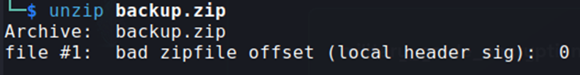
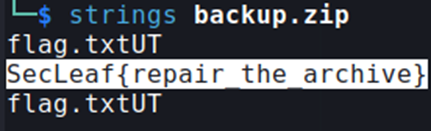

## Description:
The backup archive seems damaged.  
But maybe not everything is lost.  
Flag Format: SecLeaf{}

## Solution:
1. I tried to extract the given zip file but got an error.  

2. I ran `strings backup.zip` and found the flag.  

## Flag:
SecLeaf{repair_the_archive}