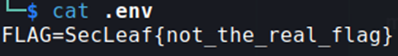
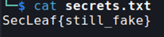
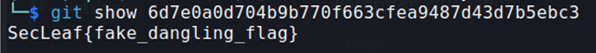

## Description:
A developer force-pushed several times before the repository was archived.  
We suspect sensitive data may still exist somewhere in the project history.  
Some files may no longer be referenced.  
Flag Format: SecLeaf{}

## Solution:
1. First, I tried `cat .git/logs/HEAD` and found a commit hash with sensitive information. I checked out using this hash and found an `.env` file, but it only contains a fake flag.  

2. Using `git fsck --lost-found`, I found a dangling commit and a dangling blob. I checked out using the dangling commit hash but found another fake flag.  

3. Next, I tried the dangling blob but got ANOTHER fake flag.  

4. I was running out of ideas so I tried to just search for the flag (`grep -R "SecLeaf{" .`). Luckily *(and surprisingly)*, I found the flag in `./.git/info/exclude`.

## Flag:
SecLeaf{history_was_the_trap}