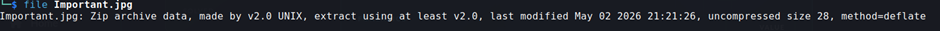
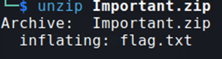

## Description:
A suspicious image file was recovered during investigation. It appears harmless, but appearances can be misleading.  
Inspect the file carefully, determine its true format, and recover the hidden flag.  
File Provided: important.jpg  
Flag Format: SecLeaf{}

## Solution:
1. I tried to open the image file but failed, so I used `file` to check the file type and found that it's actually a ZIP archive!  

2. I used `mv` to change the file extension to `.zip` then unzipped the archive to retrieve the flag.  

## Flag:
SecLeaf{extensions_can_lie}