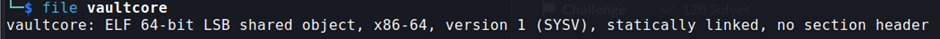

## Description:
We recovered a protected vault executable from an abandoned workstation.  
Initial analysis suggests:  
- anti-debugging routines  
- payload decryption  
- integrity verification  

Can you recover the secure access token?  
Flag format: SecLeaf{}

## Solution:
1. We are given an executable file. First, I used `file` to check the file type but didn't find anything interesting.  
  
2. I ran the program but it didn't ask for any input or give the flag.
3. Since this is a miscellaneous challenge and not a RE challenge, I tried using `strings` to see if I could find anything helpful. Turns out that's all I needed to find the flag.

## Flag:
SecLeaf{str1ngs_1s_4ll_y0u_n33d}