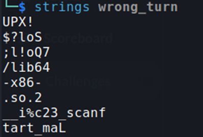
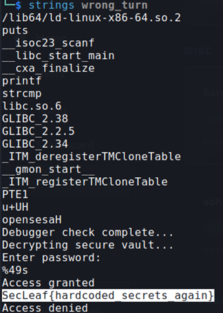

## Description:
There is Secure vault which has hard coded flag in it.  
Decrypt the password to unlock the vault.  
Flag format: SecLeaf{}

## Solution:
1. We are given an executable file which is supposed to contain a hard coded flag. I ran `strings wrong_turn` and found UPX strings, indicating that binary has been packed using UPX.  
  
2. I unpacked the file using `upx -d wrong_turn`, then used `strings wrong_turn` to find the flag.
  

## Flag:
SecLeaf{hardcoded_secrets_again}