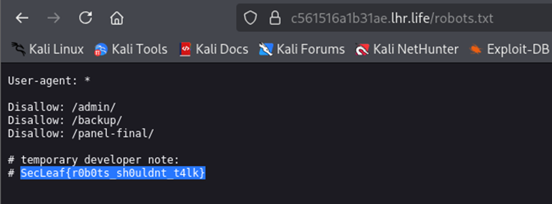

## Description:
We discovered a partially exposed internal web portal during reconnaissance.  
Developers claimed sensitive endpoints were "properly hidden."  
Can you discover what was left behind?  
Flag format: SecLeaf{}

## Solution:
1. I accessed the website using a browser and viewed the source code but didn't find anything interesting.
2. Next, I visited `robots.txt` and found the flag.  
  

## Flag:
SecLeaf{r0b0ts_sh0uldnt_t4lk}