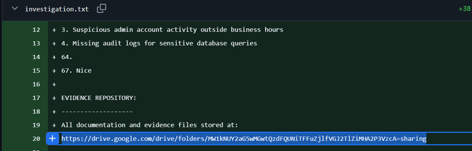
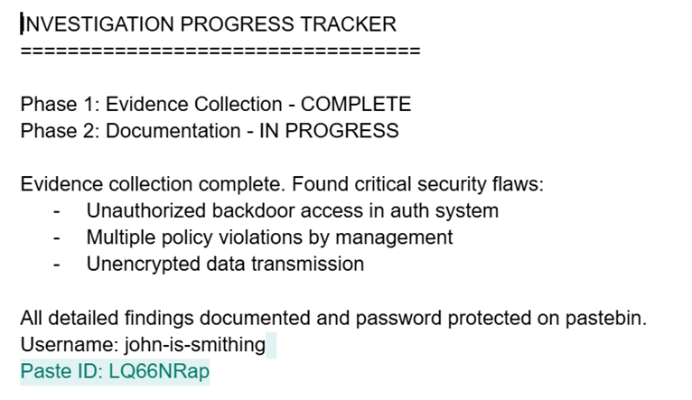
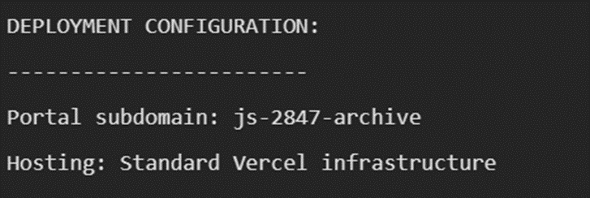
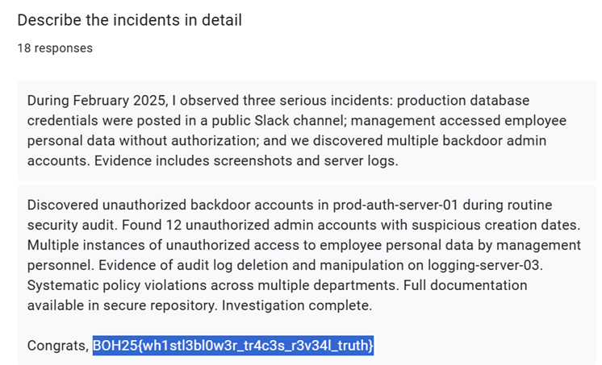

## Description:
An internal investigation into Panopticon Systems has gone public - sort of.  
The investigator, Smithing-John thought they were being careful, but digital breadcrumbs remain scattered across multiple platforms. The researcher tried, but the trail is there for those who know how to look. To begin, just know that John is careless and always forgitful.  
Your mission: Follow the investigator's footsteps and find the evidence they were trying to protect. Reconstruct the investigation and locate the final evidence.  
Flag Format: BOH25{flag_content}

## Solution:
1. At first glance, the challenge description seems simple. But upon further inspection, I noticed some clues:
- *The investigation has gone (sort of) public*, which means that anyone (including us) may be able to access the investigation documents.
- The investigator’s name, *Smithing-John* is hyphenated. Maybe it’s not their real name, but some kind of nickname or username?
- *Multiple platforms* tells us that we would need to be looking at many places.
- *John is careless and forgitful*. The description says forgitful, not forgetful. This is probably not a typo, but a hint to look in GitHub. 
2. I began the search by searching for a GitHub user named `Smithing-John`. I found one user with that name. This user has only one repository, and the commit dates are relatively recent. 
3. A careless person would probably leave many traces in the commit history. I looked through the commit messages, and found one interesting one, "adding investigation notes and evidence tracking".
4. In the file `investigation.txt`, it is mentioned that the documentation and evidence files are stored in Google Drive, along with the link. I happily copy-pasted the link into my browser, only to find that the link does not work!

3. I *(eventually)* realised that part of the link was encoded in Base64. I decoded it in CyberChef and used the correct link. In the Google drive folder, there are several files. I looked through them one by one, and in the change history for the file named `investigation_report`, I found John saying that he posted his findings on Pastebin. 

4. With the Pastebin username, I successfully found the Vercel configuration details at [John's Pastebin profile](https://pastebin.com/u/john-is-smithing).

5. Using the given subdomain, I was able to access the [investigation portal](https://js-2847-archive.vercel.app/). One of the features of the app allows users to submit whistleblower reports. Since the name of the challenge is used in this feature's description, I decided to explore this first. 
6. There are four Google forms that users can submit. I opened and submitted a response for each one and found something interesting in the Employee Testimonies form. After submitting a response, I was given the option to view previous responses! I looked through the responses to the question asking for details of the reported incident, and found a surprise in one of them.

## Flag:
BOH25{wh1stl3bl0w3r_tr4c3s_r3v34l_truth}