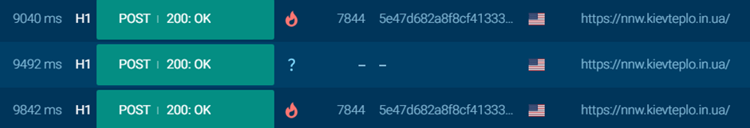

## Description:
What is the primary domain associated with the malware's command and control (C2) communications?  
Flag format : RE:CTF{xxx.xxxxxxxxx.xx.xx}

## Solution:
1. On the bottom left section of the same website, we can see the HTTP requests made. I scrolled down and found a few requests marked as malicious. These requests are made to the same URL, from which I got the domain name.  

## Flag:
RE:CTF{nnw.kievteplo.in.ua}