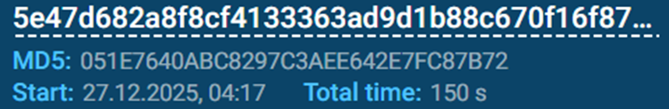

## Description:
This is a continous question. Refer to this site as a guideline for initial investigation : https://app.any.run/tasks/74939a36-b81c-408a-9a2e-bfa6a669b17b/   
What is the MD5 of this file?  
Flag format : RE:CTF{MD5} --case sensitive

## Solution:
1. From the given link, we are given the MD5 hash.  

## Flag:
RE:CTF{051e7640abc8297c3aee642e7fc87b72}