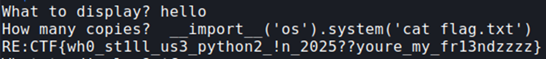

## Description:
I'm trying to make binary challenge using C, but skill issue hit me. So i code this with help of AI in Python. <3

## Solution:
1. From the Python script, I noticed that it uses the functions `raw_input()` and `xrange()`, which only exist in Python 2. 

2. A crucial vulnerability of the code is that `input()` in Python 2 evaluates the input as Python code (unlike `input()` in Python 3). So, when prompted for the number of copies, I injected code to read the flag from a file.

## Flag:
RE:CTF{wh0_st1ll_us3_python2_!n_2025??youre_my_fr13ndzzzz}