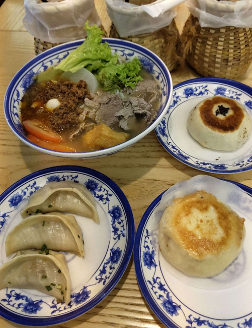

## Description:
I forgot where I had my lunch just now........................ Find the place pretty please 😫  
Flag-format : RE:CTF{what.3.words}

## Solution:
1. We are given the following image:  

2. I tried to perform a reverse search using Google Lens but couldn't find any convincing matches. 
3. The food is clearly Chinese food, so I thought searching in Chinese social media may be a better idea. I used Xiaohongshu to reverse search this image and found one image with very similar food and crockery. The restaurant is Hai Kee Fried Beef Bun at Petaling Street, KL. 
4. But the flag wants 3 words, so I tried many variations: Hai.Kee.KL, Hai.Kee.Malaysia, Haikee.Petaling.Street but all were incorrect. As I was running out of attempts, I created a support ticket (the organisers mentioned that we can check our flag with them before submitting on the CTFd platform), and the challenge creator told me to look at the flag format "very very very carefully".
5. That was when I realised that "what.3.words" doesn't literally mean "what 3 words should go here" but rather [what3words.com](https://what3words.com/). I entered the address of Hai Kee and got three words: timing.swelling.entertainer. With that, I finally got the correct flag.

## Flag:
RE:CTF{timing.swelling.entertainer}