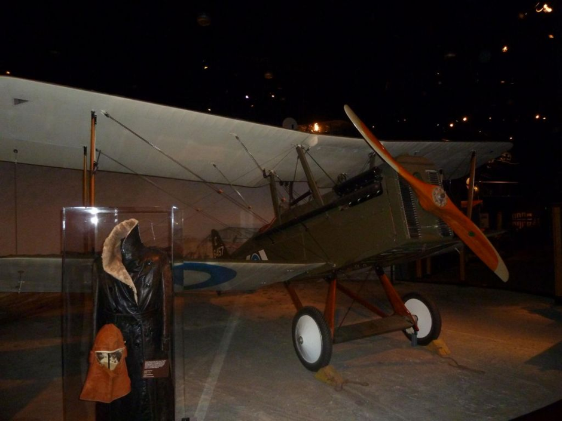

## Description:
Randy is hiding a vintage military plane somewhere, need your help to find where is the plane stored at.  
Flag-format : RE:CTF{4MMM+GV}

## Solution:
1. We are given the following image:

2. I used Google Lens to reverse search this image and found that the plane is the Royal Aircraft Factory S.E.5a, a British biplane fighter aircraft from World War I. 
3. I also found [this article on **Randy’s** Warbird Profiles](https://vintageaviationnews.com/warbird-articles/randys-warbird-profiles-royal-aircraft-factory-s-e-5a.html) about a replica of the aircraft at the Museum of Flight in Seattle. The name **Randy** in this article matches the name in the challenge name and description, so the image is probably referring to this replica rather than the actual plane (which is at the Royal Air Force Museum at Hendon). 
4. I used Google Map to find the Google Plus Code of the museum and wrapped it in the flag format.

## Flag:
RE:CTF{GP93+C7}