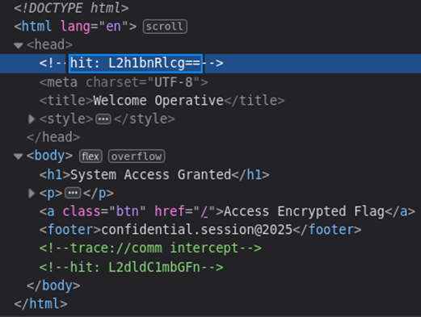

## Description:
A simple page hides deeper secrets. Encoded clues lead to hidden paths, but the final answer is twisted in classic fashion. Can you unravel the mystery and claim the flag?

## Solution:
1. Inspect the source code of the website. We see two important comments containing base64 strings. 
2. Use CyberChef to decode them, and we get `/hunter` and `/get-flag`. 
3. Combine them to get the path to the next page of the website (`/hunter/get-flag`). We are given an encrypted message with the flag. 
4. Use CyberChef ROT13 Brute Force to get the flag.

## Flag:
HUNTER{sequential_caesar_cipher_FLAGHUNTER2.0}