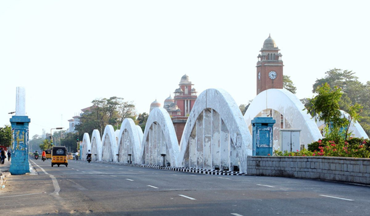

## Description:
An old coastal city holds a landmark where countless footsteps have crossed between land and sea. Built in the colonial era, this structure has watched fishermen cast their nets, film crews shoot iconic scenes, and morning joggers chase the sunrise. Your task is to uncover the name, its home city, and the country where this enduring span still stands.
Flag Format = HUNTER{Bridge_Name-Ctiy-Country}

## Solution:
1. We are given the following image:

2. A quick search using Google Lens tells us that this is the Napier Bridge located in Chennai, India. 

## Flag:
HUNTER{Napier_Bridge-Chennai-India}