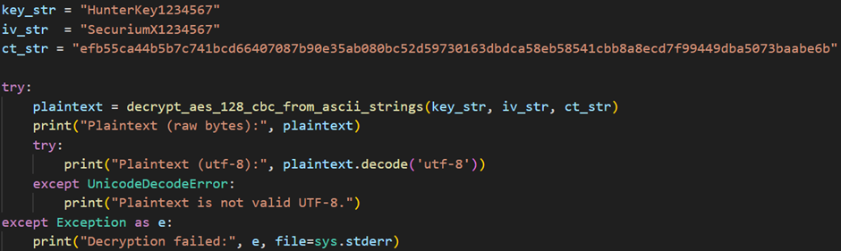

## Description:
This binary performs a few self‑checks and “keeps secrets”. Hidden inside the executable is a small AES‑128‑CBC ciphertext and the secret key/IV used to encrypt it. If you can find both the ciphertext and the correct key/IV, decrypting them will reveal the flag.

## Solution:
1. Open the file in Ghidra and analyse the assembly. We find a function which performs all the decryption-related work. 
2. The fourth argument of the `EVP_DecryptUpdate` function is the ciphertext, and the fourth and fifth arguments of `EVP_DecryptInit_ex` are the key and iv respectively. Using these pieces of information, we can write a Python script to decrypt the ciphertext. 

## Flag:
HUNTER{d41d8cd98f00b204e9800998ecf8427e}