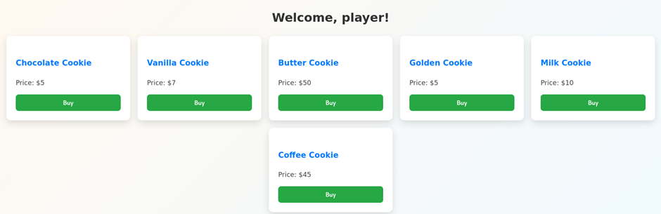

## Description:
A shopping portal challenge where users interact with the checkout system. Something seems off in the way the application handles transactions. Explore the functionality carefully and see if you can find a way to maximize your gain and capture the flag.
Hint: You have to focus on Gold

## Solution:
1. First, we need a username and password to login. Inspect the source code and we find a set of credentials as a comment. 
2. Use the given username and password to login. There are six types of cookies we can purchase, each with its own price.  

3. Either by looking at the source code or viewing the HTTP request in BurpSuite, we notice that there are two parameters being sent: id and discount. 
4. I tried incrementing the id to 7, but that didn’t work. However, incrementing the discount would reduce the price of the cookie. 1 discount = $0.05, and there is no limit on the discount for each cookie.  
5. The hint said that we have to focus on Gold, implying the "Golden Cookie". We are supposed to "maximise our gain", which means reducing the amount we have to pay. Set discount to 100 (which brings down the cost to 0 as $0.05*100=$5), and we get the flag.

## Flag:
HUNTER{h!dd3n_d!5c0unt_g0lden_cook!e}