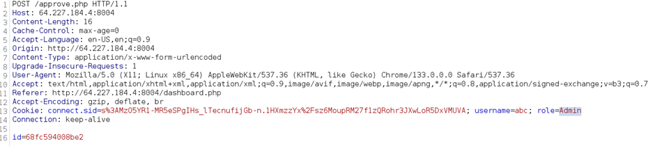

## Description:
A dark-themed document management portal where users explore hidden features and challenges. Test your skills navigating through its layers, uncovering secrets, and proving your ability to outsmart the system.

## Solution:
1. Create an account and login. We can create and upload documents, waiting for approval. 
2. Only admins can approve documents, so let’s make ourselves an admin. Use BurpSuite to intercept the request, and modify the value of “role” in the cookie from "user" to "Admin". Note that it is case-sensitive and "admin" will not work. Now we’re the admin, and we get the flag.  

## Flag:
HUNTER{C00K13_T4MP3R1NG_W1N}