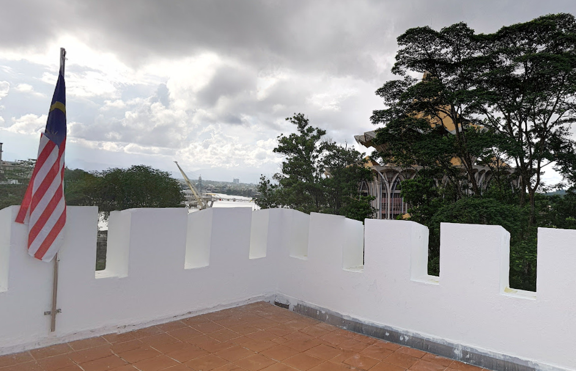

## Description:
Protect this place from the pirates! Find the location where this photo was taken.

Up to four decimal only.

"GCTF25{latitude,longitude}"

## Solution:
1. We are given an image.

2. A quick search with Google Lens tells us that the photo was taken at Fort Margherita, Kuching.
3. Use Google Earth to obtain the coordinates.

## Flag:
GCTF25{1.5606, 110.3494}
