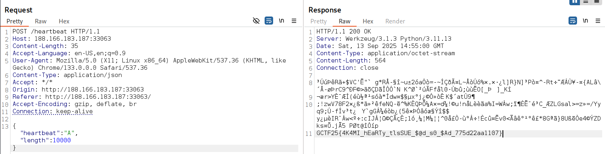

## Description:
Akami’s web server is leaking more than just love letters—it’s bleeding. Who hurt Akami..

## Solution:
1. We are given a website which receives user input and outputs some text in response.
2. Based on the name and description of this challenge, we need to exploit the Heartbleed vulnerability.
3. We send a JSON payload with an intentionally mismatched length, and get the flag in response.

## Flag:
GCTF25{4K4MI_hEaRTy_tlsSUE_$@d_s0_$Ad_775d22aa1107}
