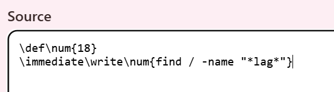
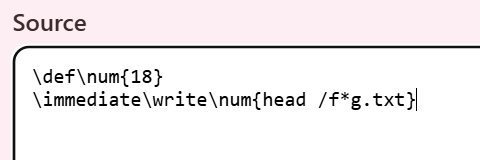
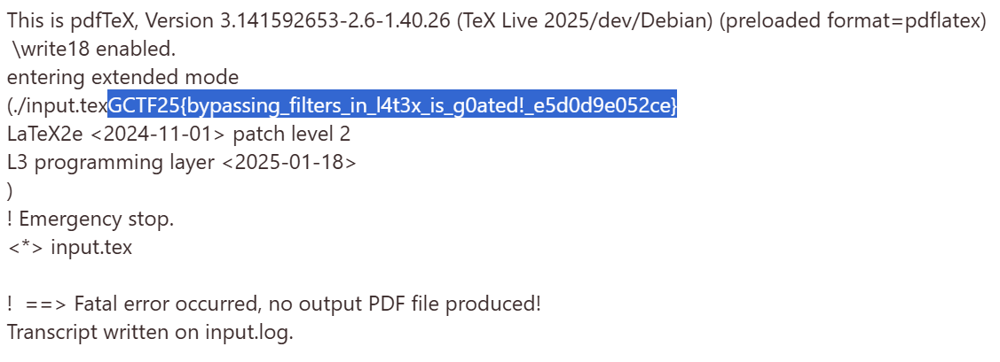

## Description:
After discovering a critical flaw in the original version, she released v2 with “improved security.” But did she really fix everything?

## Solution:
1. Like the first version, \write18 is enabled. But this time, there are filters that block keywords including flag, cat, write18 etc. So, we need to find a way to bypass these filters.
2. This can be done using `\def` and wildcard (`*`).
3. Since we already have a clue where the text file containing the flag is from the previous challenge, we can directly search for the text file in the same location as before for confirmation, as shown below:  

4. Since cat is also blacklisted, we can use alternative commands to view the contents of the text file, such as head.  

## Flag:
GCTF25{bypassing_filters_in_l4t3x_is_g0ated!_e5d0d9e052ce}
