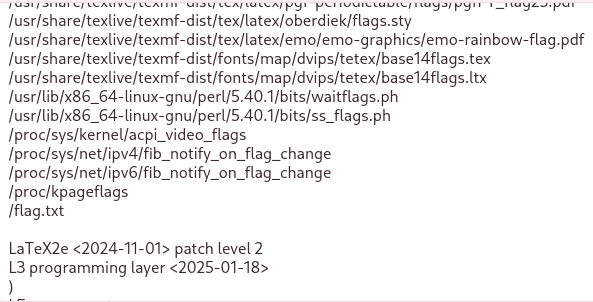

## Description:
During preparation for CPTS, Kyla decided to build a custom reporting engine to automate PDF generation. It worked beautifully—until it didn’t.

## Solution:
1. The given website converts user input into a pdf, provided that the user enters correct LaTeX syntax.
2. After entering arbitrary input, we see from the compilation log displayed that \write18 is enabled, which means we can exploit this vulnerability to execute commands.
3. Using \immediate\write18{find / -name "*flag*"}, we are able to find a text file named flag.txt.  

4. Use \input{/flag.txt} to read the file, and we get the flag.

## Flag:
GCTF25{DO(UmEnT4T!on_1n_IatEX_Is_hArdc0R3!_18bb2f32dda1}
