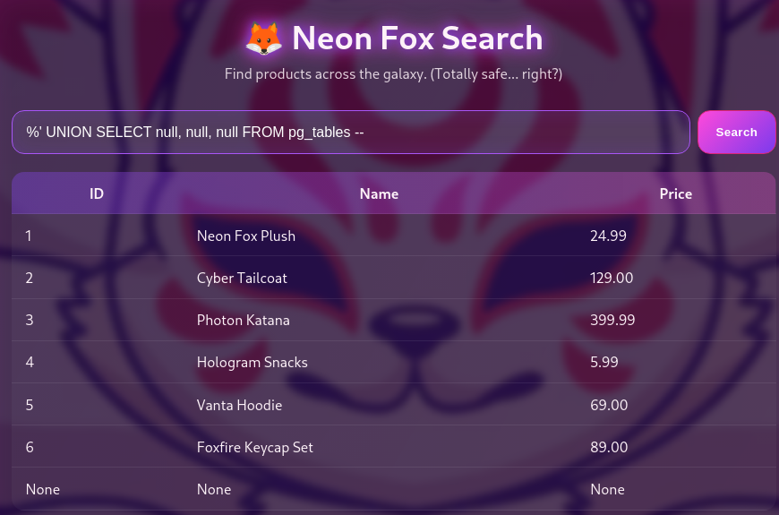
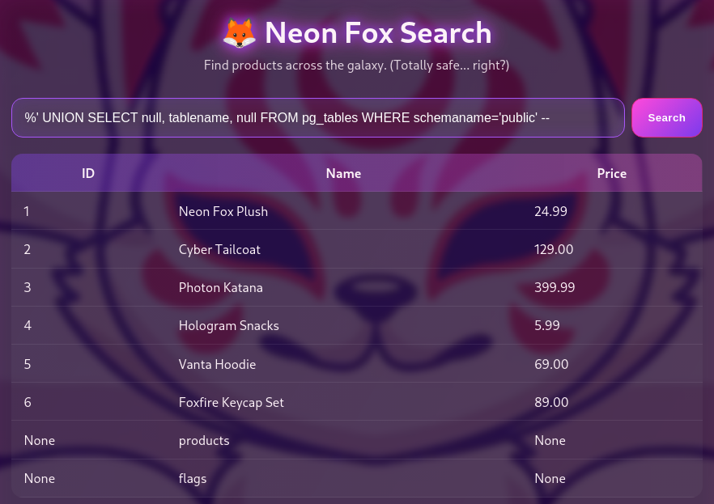
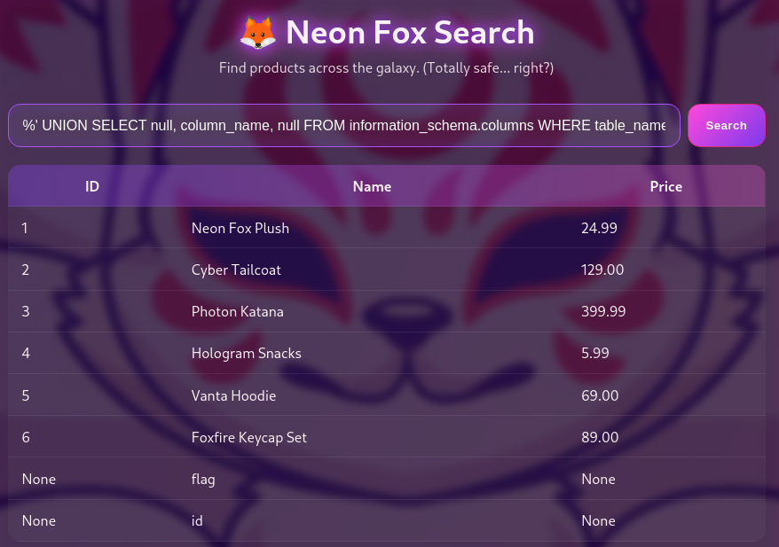
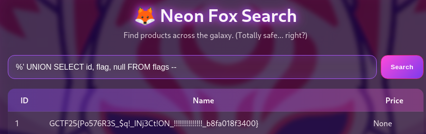

## Description:
Emmy's latest creation is a web application with serious aesthetic—and some questionable logic.

## Solution:
1. The given website has a search function, which seems like a typical SQL injection challenge.
2. We try to verify this by sending one single quote, which displays the executed SQL query, confirming that the website is vulnerable to SQL injection.
3. From the SQL query, ILIKE tells us that it is a PostgreSQL database.
4. Based on the output from the website, the SQL query retrieves 3 columns, but we can verify this before proceeding with our attack.  

5. Next, we can list the user-created tables in the database.  

6. Our flag is most likely in the table called "flags", so list the fields in this table.  

7. Lastly, retrieve the flag.  

## Flag:
GCTF25{Po576R3S_$q!INj3Ct!ON!!!!!!!!!!!!!!_b8fa018f3400}
