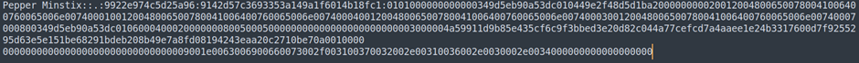
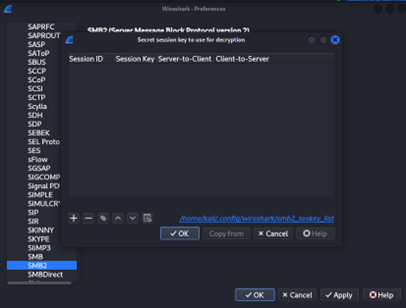
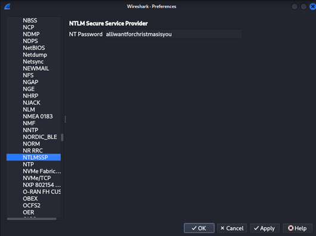

## Description:
Help Santa's elf recover Santa's secret message!
  
Difficulty: Easy

## Solution:
1. We are given a pcap file with several SMB packets. Initially, I had no idea what to do, so I began searching online for SMB forensics CTF challenges and stumbled upon a TryHackMe room named "Block" which is similar to this challenge. 
2. I read [writeups](https://ansul71098.medium.com/block-tryhackme-walkthrough-75fd061afecb) and learnt how to use credentials to get the SMB hash, crack it and decrypt the SMB packets. But in the THM room, a Local Security Authority Subsystem Service (LSASS) dump was provided along with the pcap file, but now I'm only given the pcap file. So I did some further research and learnt [how to extract the hash from the Wireshark capture itself](https://www.youtube.com/watch?v=lhhlgoMjM7o). 
3. Here’s some details on where to find the required information:
- Username: NTLMSSP_AUTH packet > SMB2 > Session Setup Response > Security Blob > GSS-API > Simple Protected Negotiation > negTokenTarg > NTLM Secure Service Provider > User name
- Domain: NTLMSSP_AUTH packet > SMB2 > Session Setup Response > Security Blob > GSS-API > Simple Protected Negotiation > negTokenTarg > NTLM Secure Service Provider > Domain name
- Challenge: NTLMSSP_CHALLENGE packet > NTLM Secure Service Provider > NTLM Server Challenge
- HMAC-MD5: NTLMSSP_AUTH packet > SMB2 > Session Setup Response > Security Blob > GSS-API > Simple Protected Negotiation > negTokenTarg > NTLM Secure Service Provider > NTLM Response > NTLMv2 Response > NTProofStr (or just the first 16 bytes (32 hex digits) of NTLMv2Response)
- NTLMv2Response: NTLMSSP_AUTH packet > SMB2 > Session Setup Response > Security Blob > GSS-API > Simple Protected Negotiation > negTokenTarg > NTLM Secure Service Provider > NTLM Response > NTLMv2 Response
4. Combine them to form the hash: `username::domain:challenge:HMAC-MD5:NTLMv2Response` and save it in a txt file.  

5. Then, I used `hashcat` with the infamous wordlist `rockyou.txt` to crack it and got the password: **alliwantforchristmasisyou**. 
6. Now, here’s where things got tricky (for me). According to the writeup I mentioned earlier, I need to use a Python script to get a random session key, then use the session ID and this random session key to decrypt the SMB traffic. I tried that, but my packets remained encrypted.  

7. I searched for more writeups on the THM challenge and found [a YouTube tutorial](https://www.youtube.com/watch?v=3-pMkmHg8Ag) which simply uses the password to decrypt the SMB packets. I inserted the password into Wireshark > Edit > Preferences > Protocol > NTLMSSP, and I successfully decrypted the SMB packets.  

8. Lastly, I exported an SMB object file (File > Export Objects > SMB > select the one with `/flag.txt`) and got a text file containing the flag.

## Flag:
HEX{3lVe5_uS3_1Ns3cUR3_P@$$w0rd5}