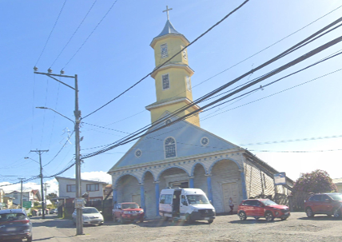
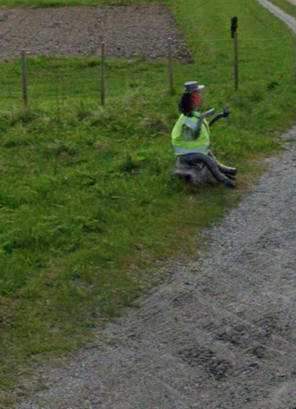
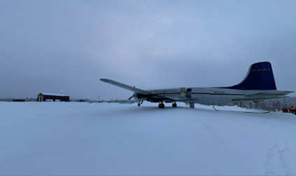
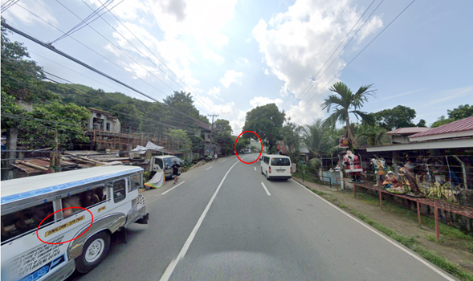
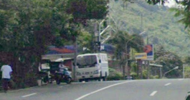
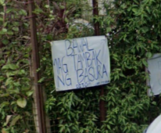
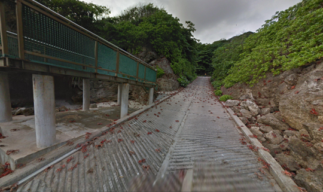

## Description:
This OSINT challenge consists of five sub-challenges where players are required to identify the latitude and longitude of the locations in each given 360 view. 

## Solution:
**Tree**
1. I used Google Lens to search for the church in the image.
 
2. It turned out to be Church of Chonchi in Chile. Using Google Earth, I found the same spot as the given image. The latitude and longitude are: -42.624,-73.773.

**Reindeer**
1. I reverse searched a screenshot of the queer reindeer-scarecrow-security guard (?), and found [this Reddit post on the geoguessr subreddit](https://www.reddit.com/r/geoguessr/comments/rao1il/norway_please_explain_what_is_going_on_here/).
 
2. The OP very helpfully left a link to the Google street view of the exact location in the comments, which gave the correct coordinates: 70.133,22.990.

**Snow**
1. I used Yandex Images to reverse image search a screenshot of the airplane and the red building.
 
2. I found the exact same image in a [video](https://anna-news.info/opyat-oni-tyoploe-s-myagkim-sravnivayut/?utm_medium=organic&utm_source=yandexsmartcamera). Both the page and the video are in Russian, but I translated the subtitles (which included the name of the airport in the photo) to English. With a little bit of trial and error adjusting the coordinates, I finally got the correct one: 66.550,-152.632.

**Santa**
1. In the image, there is a jeepney travelling between Siniloan and Santa Cruz (both located in Philippines) and a sign in Filipino, confirming that the location is in Philippines. Also, there is a Petron petrol station quite a distance away. 
 
 

2. Combining these clues, I guessed that the location is near a Petron petrol station somewhere on the way from Siniloan to Santa Cruz. Using Google Maps, I found the location in the image. The latitude and longitude are: 14.340,121.483.

**Crab**
1. I used Google Lens to search for the large number of crabs moving together and found that it is the famous red crab migration on Christmas Island.
 
2. To find the exact location on the island, I searched for spots to watch the Christmas Island red crab migration, and found a few popular ones: Drumsite, Flying Fish Cove, Ethel Beach, and Greta Beach. 
3. I tried each one in Google Earth and found that Ethel Beach has a boat ramp, which turned out to be the location I’m looking for. The latitude and longitude are: -10.464,105.708.

## Flag:
HEX{FaLal4LA741a!4la_051nT_cae64d18b3a6af6}