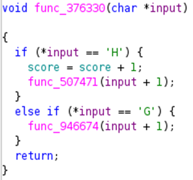

## Description:
Help Santa's elves find a path down the Christmas Tree!

Difficulty: Easy

## Solution:
1. First, I ran the program to get a look at how it runs. It prompts the user for a string, and returns some text based on the input. 
2. I opened the file in `Ghidra` and saw from the decompiled source code that the main function calls a function to check the first character of the user input. Then, if the first character is correct, this function increments the score and calls another function to check the second character, and so on. 
3. By following the function calls and combining the characters in the `if` condition, I got the complete flag.
 

## Flag:
HEX{s4nt4s_c0ntRoL_fL0W_tr33}