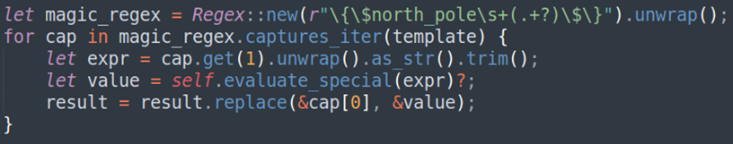
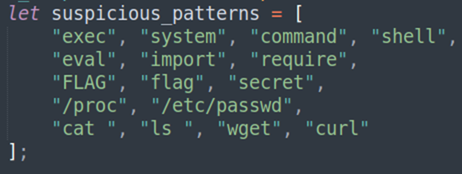
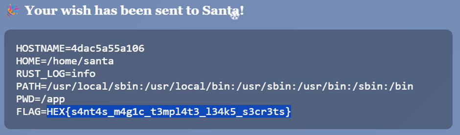

## Description:
Santa has built a new wishlist application! Send your Christmas wishes now!

Difficulty: Easy

## Solution:
1. The website has 3 input fields: name, Christmas wish and custom template. The hint given in the website says that there’s a special template expression syntax that is related to where Santa lives. 
2. I tried `{{north_pole}}` and `{{northpole}}`, but these are not recognised. So, I decided to look for clues in the source code and found this in `main.rs`.  

3. The magic syntax needed for RCE is `{$north_pole <some command>$}`. Since I’m already diving into the source code, I continued studying it and saw some blocked keywords:

4. So to list the contents of a directory, I need to use `ls$(printf ' %s' <some directory>)` (which I will later find is totally unnecessary). I started to explore the files, looking into different directories, and couldn’t find the flag.   
5. I was running out of ideas and decided to look at the source code given again. I was just looking into random files included in the zip file and saw a dummy flag in `docker-compose.yml`. I thought that the real flag may be included in the actual website’s environment variables. I ran `{$north_pole run:env$}`, and voila there’s the flag!

## Flag:

HEX{s4nt4s_m4g1c_t3mpl4t3_l34k5_s3cr3ts}
