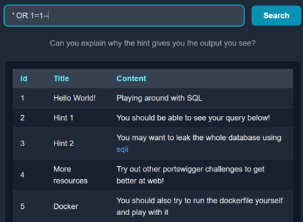
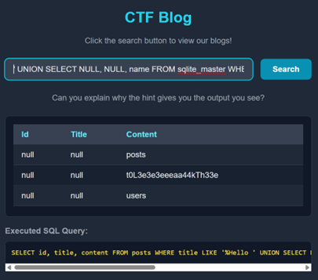
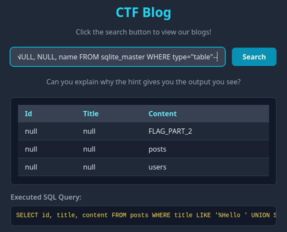

## Description:
Can you query the flag?

Difficulty: Easy

## Solution:
1. From the name of the challenge and the hint given, I could tell that this is an SQL injection challenge. First, I listed all the contents of the current table using a tautology (`' OR 1=1--`) and got the first part of the flag and some hints. 
 
2. The second hint says to leak the whole database. I tried extracting information from `information_schema.tables`, but I received an error saying that no such table exists. However, the error message also includes the DBMS used, which is sqlite3. I searched online for the correct sqlite3 syntax, which is `' UNION SELECT NULL, NULL, name FROM sqlite_master WHERE type="table"--` to list the tables in the database. Here, I found an interesting table and decided to explore this.
 
3. To list the columns of the table, I used `' UNION SELECT NULL, NULL, sql FROM sqlite_master WHERE type="table" AND name="t0L3e3e3eeeaa44kTh33e"--`. I found that the table was created with only one column, which is an integer ID. This doesn’t seem very promising, so I listed the columns of the `users` table too. This table has 3 columns: id, username and password. There may be useful information in the password field, so I listed the contents of the `users` table. I found the last part of the flag as the password of the user named `admin`.   
4. Now, I just need to find the middle part of the flag. One of the hints suggested running the dockerfile, so I ran the website and repeated the payloads I entered earlier. When I listed the tables in the database, I found that one of the table names is actually the second part of the flag, which happens to be the strange string from earlier. 
 

## Flag:
HEX{sqli_byp4sS_t0L3e3e3eeeaa44kTh33e_whole_d4t3b4s3}