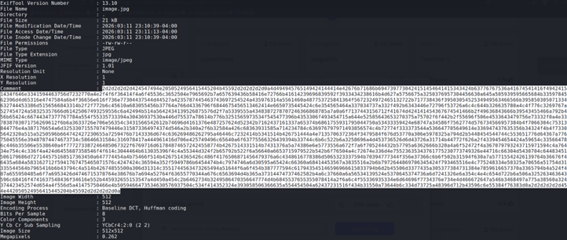
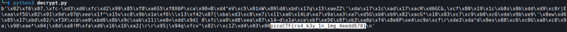

## Description:
A message has been encrypted using RSA. The public key is gone… but someone might have been careless with the private key. Can you recover it and decrypt the message?

## Solution:
1. The file given is an image of a key. Upon viewing the file's metadata, I saw a long hex comment. <br>
 <br><br>
2. I decoded the hex string and obtained an RSA private key. 
3. I saved the RSA private key as `key.pem` and used a Python script to decrypt the message.
   
```
from Crypto.PublicKey import RSA
from Crypto.Util.number import *

with open("key.pem", "rb") as k:
    key = RSA.import_key(k.read())

with open("flag.enc", "rb") as f:
    ciphertext = bytes_to_long(f.read())

plaintext = pow(ciphertext, key.d, key.n)
print(long_to_bytes(plaintext))
```



## Flag:
picoCTF{rs4_k3y_1n_1mg_4eedd678}
