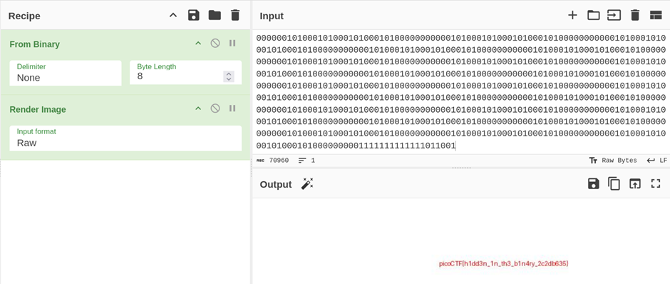

## Description:
This file doesn't look like much... just a bunch of 1s and 0s. But maybe it's not just random noise. Can you recover anything meaningful from this?

## Solution:
1. The given file contains a long binary string. I useed `From Binary` followed by `Render Image` in Cyberchef to convert the binary back into an image which contains the flag.  

## Flag:
picoCTF{h1dd3n_1n_th3_b1n4ry_2c2db635}