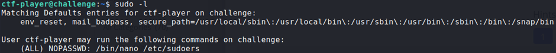
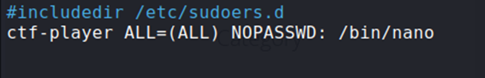

## Description:
You have complete power with nano. Think you can get the flag?

## Solution:
1. I found the flag file in the current directory. However, I did not have the permissions needed to view it using `cat`. 
2. I used `sudo -l` to view the permissions of the current user and found that I can edit `/etc/sudoers` using `nano`.  

3. I edited `/etc/sudoers` to allow ctf-player to run `nano` on all files.  

4. Then, I used `nano` to open the flag file.

## Flag:
picoCTF{n4n0_411_7h3_w4y_7fcf8f8d}