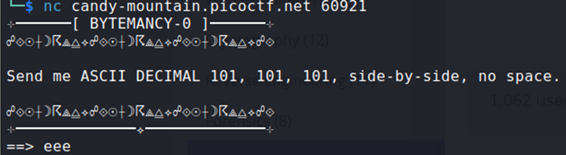

## Description:
Can you conjure the right bytes?

## Solution:
1. We are asked for the corresponding ASCII character for decimal value 101, which is e. Enter "eee" to get the flag.  

## Flag:
picoCTF{pr1n74813_ch4r5_334c472c}