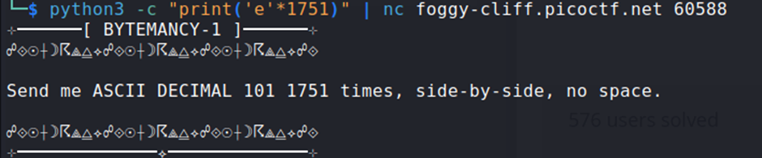

## Description:
Can you conjure the right bytes?

## Solution:
1. Looking at the source code, we need to send the ASCII character for decimal value 101 (which is 'e') 1751 times. Using a one-liner,  

## Flag:
picoCTF{h0w_m4ny_e's???_706320e0}