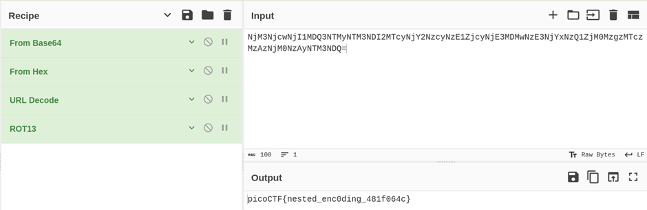

## Description:
We intercepted a suspiciously encoded message, but it’s clearly hiding a flag. No encryption, just multiple layers of obfuscation. Can you peel back the layers and reveal the truth?

## Solution:
1. The encoded flag ends with "=", indicating that it is encoded in base64. When I pasted the string in the input box in CyberChef, it suggested "From Base64" followed by "From Hex". 
2. After applying these transformations, the string contained two % symbols, which may be the two curly braces encoded using URL encoding. 
3. After URL decoding, the output seems to be in the correct flag format, but the letters are still incorrect. Finally, I applied ROT13 to get the flag.  

## Flag:
picoCTF{nested_enc0ding_481f064c}