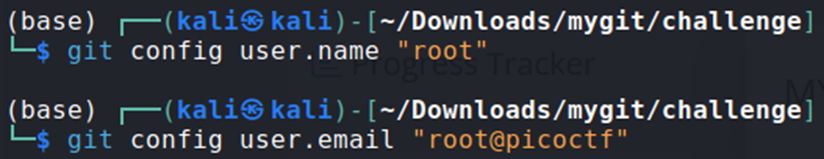

## Description:
I have built my own Git server with my own rules!

## Solution:
1. The README says that we need to push `flag.txt` as the user `root` with the email `root@picoctf` to get the flag. After setting the GitHub username and email, I created an empty text file named `flag.txt`, committed it and pushed it to get the flag.  

## Flag:
picoCTF{1mp3rs0n4t4_g17_345y_06835333}