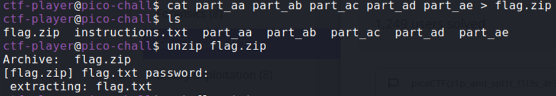

## Description:
After logging in, you will find multiple file parts in your home directory. These parts need to be combined and extracted to reveal the flag.

## Solution:
1. The flag was zipped then split into 5 separate files. I combined the files into one zip archive using `cat` and output redirection (`>`).
2. A password is needed to extract the flag. I found this password in the `instruction.txt` file - "supersecret".  

## Flag:
picoCTF{z1p_and_spl1t_f1l3s_4r3_fun_81362b37}