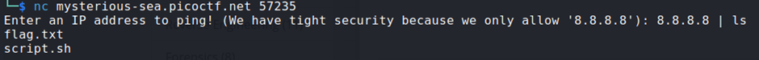

## Description:
Can you make the server reveal its secrets? It seems to be able to ping Google DNS, but what happens if you get a little creative with your input?

## Solution:
1. The service only allows us to ping 8.8.8.8. However, I was able to execute two commands at a time by concatenating them using `|`. 
2. I listed the contents of the current directory and found a text file containing the flag.  

## Flag:
picoCTF{p1nG_c0mm@nd_3xpL0it_su33essFuL_d1fdbdd0}