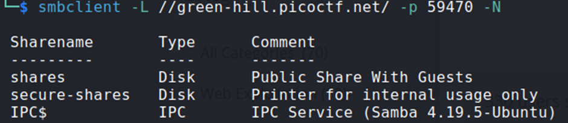
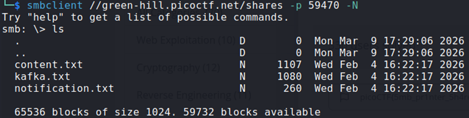
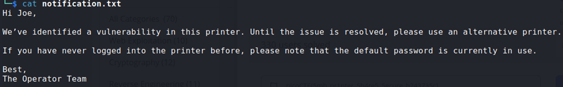
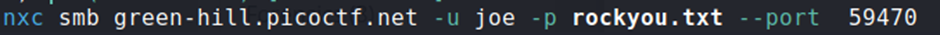
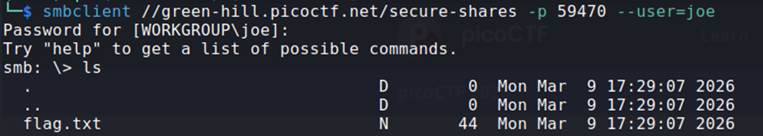

## Description:
A Secure Printer is now in use. I’m confident no one can leak the message again... or can you?

## Solution:
1. First, I listed the available SMB shares.  
   
2. Then, I connected to the public share and downloaded the available files.  
   
3. There wasn’t anything interesting in `content.txt` and `kafka.txt`, but I found a clue in `notification.txt`:  
   
4. From this message, I identified a potential username "Joe", with a default (weak) password. This password should be able to be cracked using `rockyou.txt`. I used `nxc` for this task.  
   
5. I successfully cracked Joe’s password, "popcorn" and used it to connect to the private share.  
   
6. Lastly, I downloaded the flag file.

## Flag:
picoCTF{5mb_pr1nter_5h4re5_5ecure_b243735c}