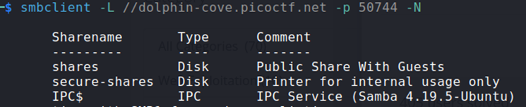
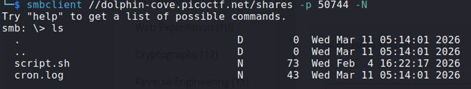
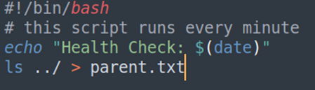
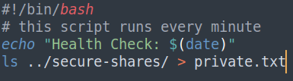
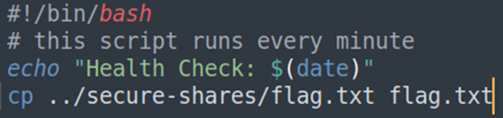

## Description:
I accidentally left the debug script in place… Well, I think that's fine - No one could possibly access my super secure directory.

## Solution:
1. First, I listed the available SMB shares.  
   
2. Then, I connected to the public share and downloaded the available files.  
   
3. A Bash script prints the text "Health Check:" followed by the current date and time. Since the script is executed every minute, it can be used to perform malicious actions, such as revealing the flag. 
4. Since I can download and upload files to the public share, I could alter the script to help me retrieve the flag. The plan: modify the script, upload it to the public share, wait for the script to execute at the next minute, download the relevant files.
5. First, I listed the contents of the parent directory to check the correct path to the private share.  
   
6. After confirming the path to the private share, I listed the contents of the private share.  
   
7. Lastly, I copied the contents of the flag file from the private share to the public share.  

## Flag:
picoCTF{5mb_pr1nter_5h4re5_r3v3r53_0eb29140}