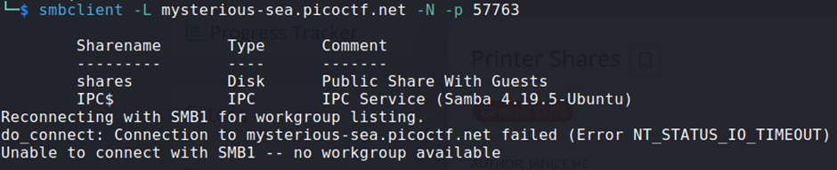
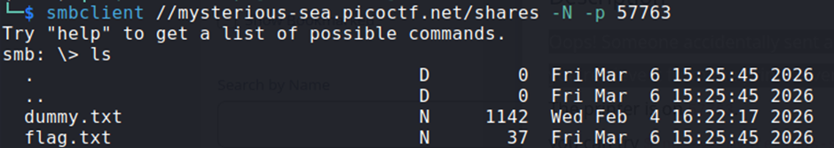

## Description:
Oops! Someone accidentally sent an important file to a network printer—can you retrieve it from the print server?

## Solution:
1. First, I listed the available SMB shares.  
  
2. Then, I connected to the public share and downloaded the flag file.  

## Flag:
picoCTF{5mb_pr1nter_5h4re5_b3f2f855}