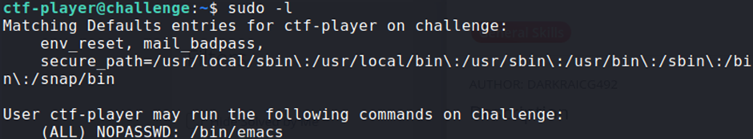

## Description:
Can you read the flag? I think you can!

## Solution:
1. After connecting to the instance with the given username and password, I used `ls` to view the files available. I found a file named flag.txt, which should contain the flag. 
2. I tried using `cat` to view the contents of the file, but I did not have the necessary permissions. I used `sudo -l` to view the permissions the current user has and found that I can use `emacs`, which is a text editor, on all files.  

3. I used `emacs` to open the flag file.

## Flag:
picoCTF{ju57_5ud0_17_c2c0d2e2}