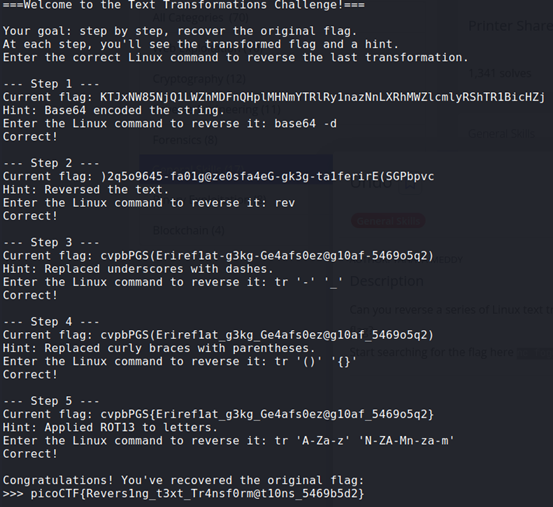

## Description:
Can you reverse a series of Linux text transformations to recover the original flag?

## Solution:
We need to give the Linux command for a series of transformations.
Here are the correct answers:   
  
Note: `tr` (translate) can be used to replace characters in text with another character, including reversing ROT13.

## Flag:
picoCTF{Revers1ng_t3xt_Tr4nsf0rm@t10ns_5469b5d2}