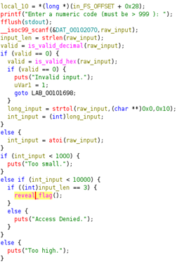
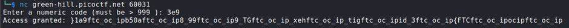
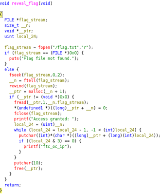

## Description:
What’s behind the numeric gate? You only get access if you enter the right kind of number. 

## Solution:
1. Using `ghidra`, I found that the program accepts either hexadecimal or decimal input, and the magic number must be greater than 999 and smaller than 10,000.  

2. The length of the input must also be exactly 3 characters. The smallest possible input would be 1,000 in decimal, which is too long (4 digits). Hence, the value must be given in hex. I chose 1,001, which is 3E9 in hexadecimal. This gave the flag, which was distorted.  

3. The `reveal_flag` function first reverses the flag then adds unnecessary strings before printing it. 

4. To reverse this, I removed all the "ftc_oc_ip" strings and reversed the resulting string to get the flag.

## Flag:
picoCTF{3_digit_hex_GT_999_8a05b9a1}