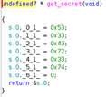
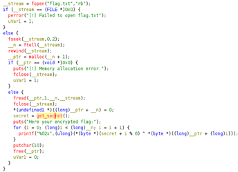

## Description:
The flag is right in front of you; just slightly encrypted. All you have to do is figure out the cipher and the key.

## Solution:
1. Using `strings`, I found that the binary was packed using Ultimate Packer for eXecutables (UPX), which is used to reduce the file size of programs. 
2. I unpacked the binary using `upx -d hiddencipher` before opening it in Ghidra. From the decompiled source code, the program has a secret variable with the value "S3Cr3t".  <br>
 <br>
3. In the main program, each byte of the flag is XORed with each byte of the secret, and the output is displayed.  <br>
 <br>
4. To reverse this, XOR the output with the secret again to get the flag.
   
```
enc = "235a201d702015483b1d412b265d3313501f0c072d135f0d2002302d01176b0a221657412e"
secret = "S3Cr3t"
flag = ""

enc_bytes = bytes.fromhex(enc)
secret_bytes = [ord(s) for s in secret]

flag = "".join(chr(enc_bytes[i] ^ secret_bytes[i % 6]) for i in range(len(enc_bytes)))
    
print(flag)
```

## Flag:
picoCTF{xor_unpack_4nalys1s_2c89add5}
