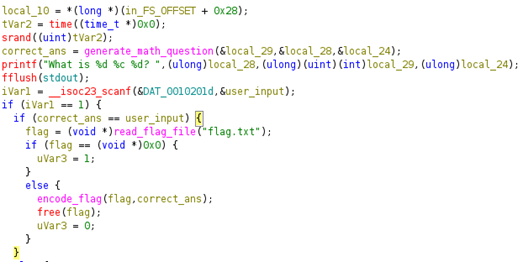
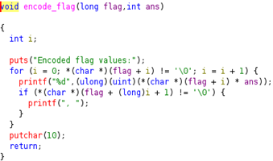

## Description:
The flag is right in front of you... kind of. You just need to solve a basic math problem to see it. But to get the real flag, you’ll have to understand how that math answer is used.

## Solution:
1. Based on the decompiled source code in Ghidra, the program randomly generates a simple math question and uses the answer to encode the flag. <br>
 <br><br>
2. The `encode_flag` function multiplies each character in the flag with the answer to the math question and outputs the integers.  <br>
 <br>
3. To reverse this, divide the integers with the answer to the math question and convert each value to its corresponding ASCII character to get the flag.
```
enc = [896, 840, 792, 888, 536, 672, 560, 984, 872, 416, 928, 832, 760, 784, 408, 832, 392, 880, 800, 760, 792, 392, 896, 832, 408, 912, 760, 808, 440, 392, 416, 456, 408, 392, 448, 1000]
ans = 8

flag = "".join(chr(int(e/ans)) for e in enc)
print(flag)
```

## Flag:
picoCTF{m4th_b3h1nd_c1ph3r_e7149318}