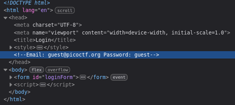
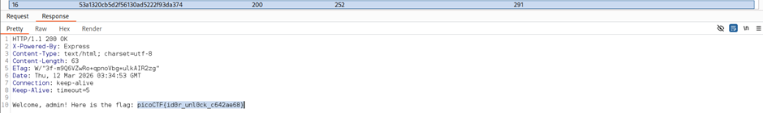

## Description:
You have gotten access to an organisation's portal. Submit your email and password, and it redirects you to your profile. But be careful: just because access to the admin isn't **directly** exposed doesn’t mean it’s secure. Maybe someone forgot that obscurity isn’t security... Can you find your way into the admin’s profile for this organisation and capture the flag?

## Solution:
1. The website requires an account to login. I found a set of guest credentials in the source code.  
   
2. After logging in as a guest, the website says that the guest account (with ID 3000) has insufficient privileges. 
3. The word "directly" is bolded in the challenge description, which may be referencing an In**direct** Object Reference (IDOR) vulnerability.
4. The link ends with a string that looks like a hash. Furthermore, the name of this challenge (**Hash**gate) despite not being a cryptography challenge made this guess seem more convincing.  
   
5. One of the hints says that there are 20 employees in this organisation. 
6. I generated the MD5 hashes of the integers from 1 to 20 and saved them to a file. Then, I used Burp Intruder to insert the payloads one by one. However, this approach was unsuccessful.
7. Since our current ID is 3000, the IDs may start from 3001 instead of 1. I repeated the same steps using the range 3001-3020 and found the flag using ID 3016.  

## Flag:
picoCTF{id0r_unl0ck_c642ae68}