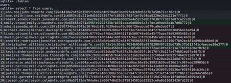
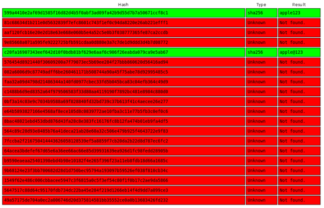
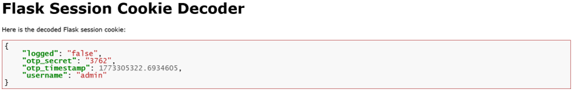

## Description:
Seems like some data has been leaked! Can you get the flag?

## Solution:
1. First, I opened the given database file using `sqlite3` and obtained the records for 20 users.  
   
2. I pasted the 20 hashes into crackstation.net and got the passwords for two users: john.doe and admin.  
   
3. The flag is probably in the admin account, but I decided to log in as john.doe first to see if I would find anything interesting. As expected, I didn't get the flag.
4. Next, I tried logging in as admin. However, admin has 2FA enabled; hence, I need to obtain the OTP in order to log in.
5. From the given app source code, I found that the OTP is stored in the Flask session cookie. Using [an online Flask session cookie decoder](https://www.kirsle.net/wizards/flask-session.cgi), I successfully obtained the OTP.  
   
6. I entered the OTP,successfully logged in and got the flag.

## Flag:
picoCTF{n0_r4t3_n0_4uth_3ed5f244}