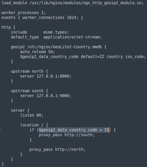

## Description:
I've set up geo-based routing - can you outsmart it? You're trying to retrieve the flag, but there's a catch: access to the real service is restricted based on your geographic location. Only requests from a specific region are routed to the server that holds the flag. Everyone else is sent somewhere... less interesting.

## Solution:
1. According to the given Nginx configuration file, if the request originates from the country with the code `IS`, the request will be passed to North. Otherwise, it is passed to South.  
   
2. According to https://www.geonames.org/countries/, IS refers to Iceland. To change my geolocation, I used [Urban VPN](https://www.urban-vpn.com/locations/iceland-vpn/) to connect to an Iceland proxy, allowing me to connect to South to get the flag. 

## Flag:
picoCTF{g30_b453d_r0u71n9_6030bc08}